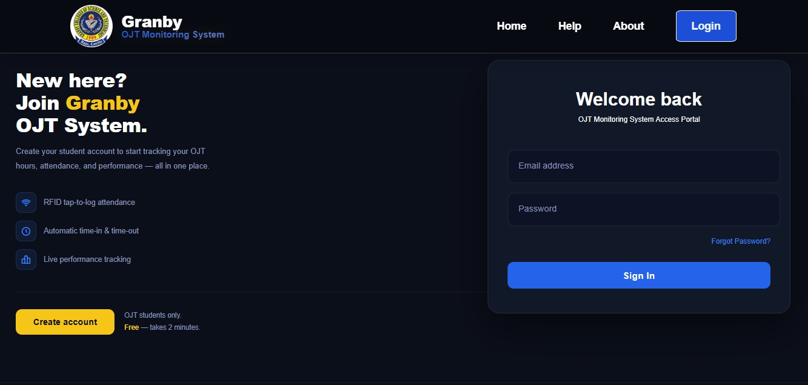
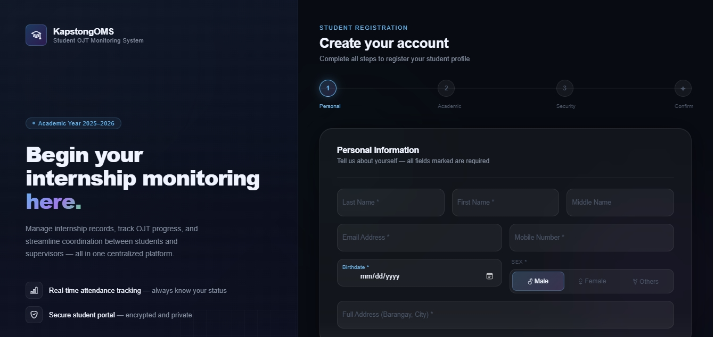
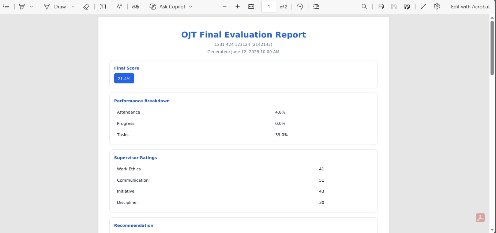
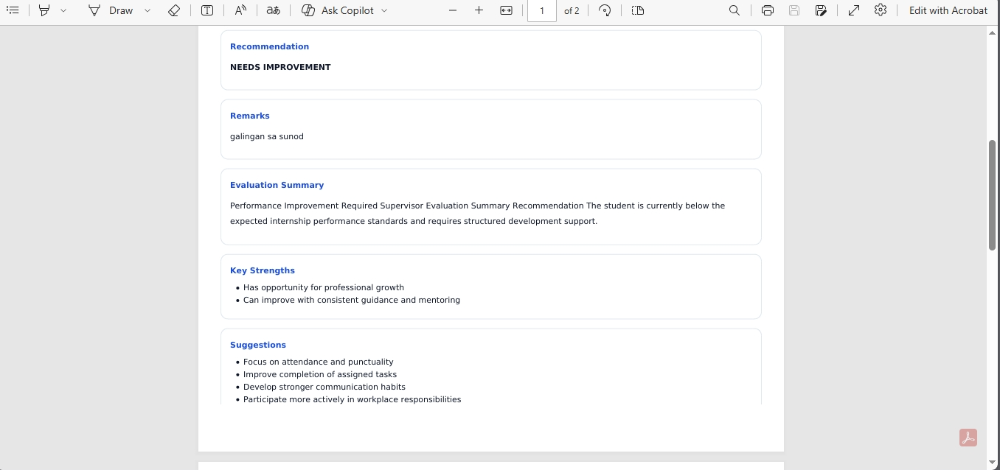

# OJT Monitoring System

### Attendance Tracking · Performance Evaluation · Predictive Analytics · Automated Notifications


---

## Overview

The **OJT Monitoring System** (Kapstong) is a web-based platform for managing On-the-Job Training programs. It allows administrators, supervisors, and students to track attendance, monitor progress, conduct evaluations, and receive automated email alerts.

---

## Features

### ▸ Attendance Tracking

- Students log daily time-in and time-out
- System computes total rendered vs. required hours
- Supports RFID-based attendance logging
- Automated email alert sent when a student misses attendance

### ▸ Performance Evaluation

- Supervisors grade assigned students using a structured evaluation form
- Evaluation records are stored and viewable per student
- Final evaluation can be exported

### ▸ Predictive Analytics

- Tracks rendered hours, remaining hours, and task progress
- Estimates OJT completion date based on student inputs
- Visual progress indicators on the dashboard

### ▸ Automated Email Notifications

- Sends email automatically when a student has no attendance log
- Sends reminder when a task deadline is overdue
- No manual action required — handled by the system

---

## Tech Stack

| Layer          | Technology              |
| -------------- | ----------------------- |
| Backend        | PHP (Vanilla)           |
| Frontend       | HTML5, CSS3, JavaScript |
| UI Framework   | Bootstrap 5             |
| Database       | MySQL                   |
| PDF Generation | Dompdf                  |
| QR Code        | phpqrcode               |
| Email          | PHPMailer               |

---

## Security & Access Control

The system uses **Role-Based Access Control (RBAC)**. Each user is assigned a role that determines what pages and actions they can access.

| Role           | Access                                                                        |
| -------------- | ----------------------------------------------------------------------------- |
| **Admin**      | Full access — manages students, supervisors, evaluations, and system settings |
| **Supervisor** | Views assigned students, submits evaluations, manages tasks                   |
| **Student**    | Views own attendance, tasks, progress, and evaluations                        |

---

## Project Structure

```
kapstong/
├── php/
│   ├── admin/              ─ Admin dashboard and functions
│   ├── supervisor/         ─ Supervisor dashboard and functions
│   ├── student/            ─ Student dashboard and functions
│   ├── auth/               ─ Role-based authentication guards
│   ├── forgot_password_function/
│   ├── rfid_functions/     ─ RFID attendance handlers
│   ├── kapstongConnection.php
│   ├── mailer.php
│   └── functions.php
├── css/
│   ├── admin/
│   ├── supervisor/
│   └── student/
├── js/
│   ├── admin/
│   ├── supervisor/
│   └── student/
├── uploads/                ─ Student documents, tasks, and reports
├── PHPMailer/
├── phpqrcode/
├── vendor/                 ─ Composer dependencies (Dompdf, etc.)
├── .env
├── index.php
└── kapstong_database_backup.sql
```

---

## Installation & Setup

### Requirements

- PHP 7.4 or higher
- MySQL
- XAMPP, WAMP, or any local server

### Steps

**1. Clone or download the repository**

```bash
git clone https://github.com/gqllahad/kapstong.git
```

Place the folder inside `htdocs` (XAMPP) or your server's root directory.

**2. Import the database**

- Open phpMyAdmin
- Create a new database (e.g., `kapstong`)
- Import `kapstong_database_backup.sql`

**3. Configure the database connection**

Open `php/kapstongConnection.php` and update:

```php
$host = "localhost";
$dbname = "kapstong";
$username = "root";
$password = "";
```

**4. Configure email**

Open `php/mailer.php` and set your SMTP credentials for PHPMailer.

**5. Set environment variables**

Copy `.env.example` to `.env` and fill in your values.

**6. Run the system**

```
http://localhost/kapstong/
```

---

## Screenshots

> On-The-Job Monitoring System

**Landing Page**

```

```

**Login**

```

```

**Signup Page**

```

```

**Dashboard**

```

```

**Attendance Page**

```

```

**Evaluation**

```


```

---

## Acknowledgements

- [Bootstrap](https://getbootstrap.com/)
- [PHPMailer](https://github.com/PHPMailer/PHPMailer)
- [Dompdf](https://github.com/dompdf/dompdf)
- [phpqrcode](http://phpqrcode.sourceforge.net/)
